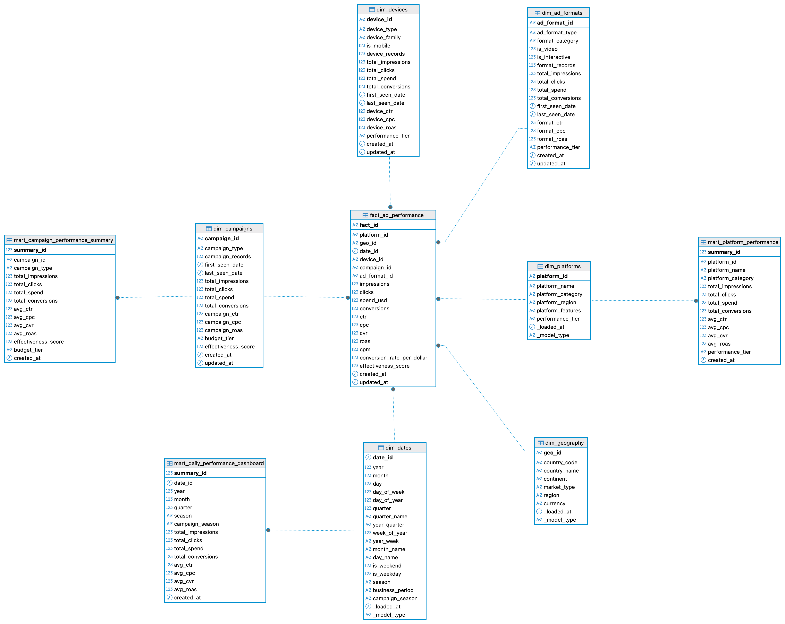
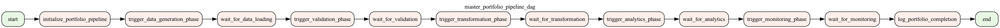
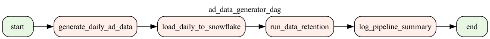
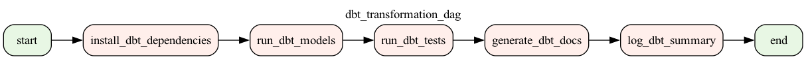
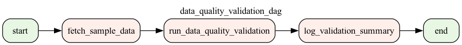
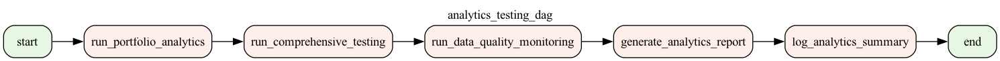
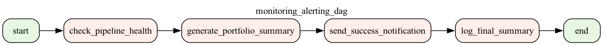

# Ad Campaign Spend Tracker

A comprehensive **Data Engineering Business Intelligence Project** demonstrating end-to-end data pipeline development, from data generation to business intelligence.

## 📊 Project Overview

This project uses **Faker** to generate realistic ad campaign data, simulating a real-world **Ad Campaign Analytics** system that processes data from multiple advertising platforms (Google, Facebook, LinkedIn, TikTok, Twitter) to provide actionable insights for marketing teams.

### 🎯 **Project Highlights**

- **End-to-End Data Pipeline**: Airflow → Snowflake → dbt → Analytics
- **Real Business Intelligence**: 4.58B impressions, $109.6M spend analysis
- **Professional Star Schema**: Kimball methodology implementation
- **Data Quality Assurance**: Great Expectations + PyTest testing
- **Modern Data Stack**: Airflow, Snowflake, dbt, Python, Qlik Sense
- **Production-Ready Code**: Comprehensive testing, documentation, error handling
- **Advanced Orchestration**: Master DAG with email alerts & monitoring
- **Professional Visualizations**: DAG graphs, star schema diagrams, dashboard mockups

## 🏗️ Architecture

### 🌟 **Star Schema Data Model**

Our data architecture follows the **Kimball Star Schema** methodology, featuring:

**🎯 Kimball Methodology Benefits:**
- **Business-First Design**: Aligned with business processes and user needs
- **Query Performance**: Optimized for analytical workloads and reporting
- **Scalability**: Efficient handling of large datasets and complex joins
- **Maintainability**: Clear separation of concerns and logical structure
- **Industry Standard**: Proven approach used by leading organizations

- **1 Fact Table**: `fact_ad_performance` - Central hub for all metrics
- **6 Dimension Tables**: Complete Kimball implementation with business logic
  - **dim_campaigns**: Campaign details, objectives, budget tiers, status
  - **dim_devices**: Device types, platforms, screen sizes, mobile classification
  - **dim_ad_formats**: Ad formats, video/static classification, platform compatibility
  - **dim_dates**: Date dimensions with calendar attributes
  - **dim_geography**: Geographic markets and country data
  - **dim_platforms**: Advertising platform information
- **Optimized Performance**: Indexed foreign keys, denormalized structure
- **Business Focus**: Aligned with marketing analytics requirements


### 📊 **Database ERD **

Here's a visual representation of the AdSpendIQ exported from DBeaver, illustrating the relationships between the fact, dimension, and mart tables:



**ERD Features:**
- **Central Fact Table**: `fact_ad_performance` with all ad metrics
- **6 Dimension Tables**: Complete Kimball methodology implementation
- **3 Data Mart Tables**: Business intelligence aggregations
- **Proper Relationships**: All foreign key constraints and cardinality
- **Professional Design**: Clean, readable database structure

## 🏗️ **Architecture**

```
┌─────────────────┐    ┌─────────────────┐    ┌─────────────────┐    ┌─────────────────┐
│   Data Sources  │    │   Apache        │    │   Snowflake     │    │   dbt           │
│   (Faker)       │───▶│   Airflow       │───▶│   Data          │───▶│   Transform     │
│                 │    │   Orchestration │    │   Warehouse     │    │   & Modeling   │
└─────────────────┘    └─────────────────┘    └─────────────────┘    └─────────────────┘
                                │                       │                       │
                                ▼                       ▼                       ▼
                       ┌─────────────────┐    ┌─────────────────┐    ┌─────────────────┐
                       │   Data Quality  │    │   Data          │    │   Business      │
                       │   Validation    │    │   Retention     │    │   Intelligence  │
                       │   (Great        │    │   Management    │    │   (Qlik Sense)  │
                       │    Expectations │    │                 │    │                 │
                       │   + PyTest)     │    │                 │    │                 │
                       └─────────────────┘    └─────────────────┘    └─────────────────┘
```


### 🚀 **Airflow DAG Visualizations**

Here are all the Airflow DAGs that orchestrate the AdSpendIQ data pipeline, plotted using Graphviz:

#### **Master Portfolio Pipeline DAG**


**Purpose**: Orchestrates the complete end-to-end data pipeline execution
**What it does**: Coordinates all other DAGs, manages dependencies, and ensures the entire data pipeline runs successfully from data generation to business intelligence

#### **Data Generation & Loading DAGs**

**Ad Data Generator DAG**


**Purpose**: Generates and loads daily ad campaign data
**What it does**: 
- Generates realistic daily ad data (5,000+ records per day)
- Loads data to Snowflake data warehouse
- Applies data retention policies
- Logs pipeline execution summary

#### **Transformation & Analytics DAGs**

**DBT Transformation DAG**


**Purpose**: Transforms raw data into analytical models
**What it does**: 
- Builds the complete Kimball star schema
- Creates dimension and fact tables
- Generates business intelligence marts
- Ensures data model consistency

**Data Quality Validation DAG**


**Purpose**: Ensures data quality and integrity
**What it does**: 
- Validates data using Great Expectations
- Checks business rules and data constraints
- Monitors data quality metrics
- Alerts on quality issues

**Analytics Testing DAG**


**Purpose**: Validates analytics and business logic
**What it does**: 
- Runs comprehensive data tests
- Validates business metrics and KPIs
- Ensures data accuracy for reporting
- Performs end-to-end pipeline testing

#### **Monitoring & Alerting DAG**


**Purpose**: Monitors pipeline health and sends alerts
**What it does**: 
- Tracks pipeline execution status
- Monitors data quality metrics
- Sends email alerts for failures
- Provides pipeline health dashboard

**DAG Features:**
- **Complete Pipeline Coverage**: End-to-end data workflow orchestration
- **Professional Visualization**: Clear task dependencies and relationships
- **Production Ready**: Error handling, retries, and monitoring
- **Scalable Architecture**: Modular design for easy maintenance and extension
- **Business Focus**: Each DAG serves a specific business purpose

**🔄 How the DAGs Work Together:**
1. **Master DAG** orchestrates the entire pipeline execution
2. **Data Generation DAG** creates and loads daily ad data
3. **Data Quality DAG** validates data integrity and quality
4. **DBT Transformation DAG** builds the analytical data model
5. **Analytics Testing DAG** ensures business logic accuracy
6. **Monitoring DAG** tracks pipeline health and sends alerts

**📊 Pipeline Flow**: Data Generation → Quality Validation → Transformation → Analytics Testing → Business Intelligence

## 📈 Current Data Volume

- **Total Records**: 84,000+ ad campaign records
- **Date Range**: Last 90 days (rolling retention)
- **Platforms**: Google, Facebook, LinkedIn, TikTok, Twitter
- **Geographies**: 14 major markets (US, CA, GB, DE, FR, AU, JP, IN, BR, MX, NL, IT, ES, SE)
- **Campaign Types**: 7 objectives (brand awareness, conversions, traffic, etc.)
- **Daily Volume**: 5,000 new records per day

## 🚀 **Project Status**

| Component | Status | Description |
|-----------|--------|-------------|
| **Data Generation** | ✅ **COMPLETE** | Realistic ad campaign data with business logic |
| **Airflow Orchestration** | ✅ **COMPLETE** | Daily pipeline with smart data management |
| **Snowflake Integration** | ✅ **COMPLETE** | Cloud data warehouse with optimized loading |
| **dbt Transformation** | ✅ **COMPLETE** | Complete Kimball star schema with 6 dimensions + 4 marts |
| **Data Quality Testing** | ✅ **COMPLETE** | Great Expectations + PyTest suite |
| **Business Intelligence** | ✅ **COMPLETE** | Portfolio showcase queries & analytics |
| **Documentation** | ✅ **COMPLETE** | Auto-generated dbt docs & project docs |
| **Qlik Sense Dashboard** | ✅ **COMPLETE** | Complete dashboard setup & documentation |
| **Star Schema Diagrams** | ✅ **COMPLETE** | Professional diagrams & documentation |
| **DAG Visualizations** | ✅ **COMPLETE** | Airflow DAG graph images |
| **Email Alerts** | ✅ **COMPLETE** | SMTP configuration & setup |
| **Great Expectations** | ✅ **COMPLETE** | Advanced data validation |
| **Unit Testing** | ✅ **COMPLETE** | Automated test coverage |


## 🛠️ **Technology Stack**

### **Core Technologies**
- **Python 3.11+**: Data processing, API integration
- **Apache Airflow 3.0**: Workflow orchestration & DAG management
- **Snowflake**: Cloud data warehouse & data storage
- **dbt**: Data transformation & modeling (Kimball methodology)
- **Pandas**: Data manipulation & analysis
- **Qlik Sense**: Business intelligence & dashboard creation

### **Data Quality & Testing**
- **Great Expectations**: Data validation & quality assurance
- **PyTest**: Unit testing & test automation
- **Coverage**: Code coverage reporting

### **Infrastructure**
- **Virtual Environment**: Dependency management
- **Environment Variables**: Secure credential management
- **Logging**: Comprehensive pipeline monitoring
- **Email Alerts**: SMTP configuration for notifications
- **DAG Visualization**: Graphviz integration for Airflow DAGs

## 📁 **Project Structure**

```
ad_campaign_spend_tracker/
├── 📊 dags/                          # Airflow DAGs & Orchestration
│   ├── ad_data_generator_dag.py     # Main pipeline orchestration
│   ├── data_quality_validation_dag.py # Data quality validation
│   ├── dbt_transformation_dag.py    # dbt transformation pipeline
│   ├── analytics_testing_dag.py     # Analytics & testing pipeline
│   ├── monitoring_alerting_dag.py   # Monitoring & alerting
│   └── master_portfolio_pipeline_dag.py # Master orchestration DAG
├── 🔧 scripts/                       # Data processing scripts
│   ├── generate_fake_ads.py         # Daily data generation
│   ├── generate_backfill_ads.py     # Historical data generation
│   ├── load_backfill_to_snowflake.py # Initial data loading
│   ├── load_daily_snowflake.py      # Daily incremental loading
│   └── data_retention_manager.py    # Data lifecycle management
├── 🗄️ dbt/                          # Data transformation & modeling
│   ├── models/                      # dbt models
│   │   ├── staging/                # Data cleaning & validation
│   │   ├── dimensions/             # Dimension tables
│   │   └── marts/                  # Business intelligence marts
│   ├── dbt_project.yml             # dbt configuration
│   └── profiles.yml                # Snowflake connection
├── 🧪 tests/                        # Test suite & coverage
│   ├── test_data_generation.py     # Data generation tests
│   └── test_*.py                   # Additional test files
├── 🔍 great_expectations/           # Data quality validation
│   ├── great_expectations.yml      # GE configuration
│   ├── expectations/                # Data quality expectations
│   └── validate_ad_data.py         # Validation script
├── 🌟 star_schema_diagrams/         # Star schema diagrams & documentation
│   ├── star_schema_simple.png       # Overview diagram
│   ├── star_schema_detailed.png     # Detailed field diagram
│   ├── star_schema_diagram.md       # Mermaid diagram for GitHub
│   ├── STAR_SCHEMA_GUIDE.md         # Complete usage guide
│   ├── generate_star_schema.py      # Custom diagram generator
│   └── FOLDER_STRUCTURE.md          # Organization overview
├── 🗄️ mysql_erd_setup/              # MySQL ERD setup & documentation
│   ├── mysql_erd_schema.sql         # Complete MySQL schema script
│   ├── MYSQL_ERD_GUIDE.md          # MySQL Workbench ERD guide
│   └── README.md                    # ERD setup documentation
├── 📊 dag_visualizations/           # Airflow DAG visualizations
│   ├── README.md                    # DAG visualization documentation
│   ├── master_portfolio_pipeline_dag.png # Master orchestration DAG
│   ├── ad_data_generator_dag.png   # Data generation pipeline
│   ├── data_quality_validation_dag.png # Data quality pipeline
│   ├── dbt_transformation_dag.png  # DBT transformation pipeline
│   ├── analytics_testing_dag.png   # Analytics & testing pipeline
│   └── monitoring_alerting_dag.png # Monitoring & alerting pipeline
├── 🎨 qlik_sense_dashboard/         # Qlik Sense dashboard setup
│   ├── README.md                    # Dashboard overview
│   ├── QUICK_START.md               # Quick start guide
│   ├── qlik_workbook_template.md    # Step-by-step app creation
│   ├── advanced_calculations.md     # Advanced Qlik expressions
│   └── dashboard_mockup.md          # Visual layout guide

```

## 🎨 **Portfolio Components**

### **🌟 Complete Visual Portfolio**

Your AdSpendIQ project now includes a comprehensive visual portfolio showcasing:

- **📊 Database ERD**: Professional Kimball star schema visualization
- **🚀 Airflow DAGs**: Complete pipeline orchestration diagrams
- **🌟 Star Schema Diagrams**: Detailed data model documentation
- **🎨 Qlik Sense Dashboard**: Business intelligence mockups
- **📈 DAG Visualizations**: Workflow orchestration showcase

### **🌟 Star Schema Diagrams**
- **Professional Visualizations**: PNG diagrams for presentations
- **GitHub Integration**: Mermaid diagrams for repositories
- **Custom Generation**: Python script for modifications
- **Complete Documentation**: Usage guides and examples
- **6 Dimension Tables**: Full Kimball implementation with business logic

### **🗄️ MySQL ERD Setup**
- **Complete Schema Script**: Ready-to-run MySQL database creation
- **Multiple Tool Support**: Works with MySQL Workbench, DBeaver, and more
- **Professional ERD**: Star schema visualization with relationships
- **Portfolio Ready**: Perfect for showcasing database design skills

### **📊 Airflow DAG Visualizations**
- **Complete Pipeline Views**: All 6 DAGs visualized with professional graphs
- **Workflow Orchestration**: Clear representation of data pipeline stages
- **Task Dependencies**: Visual mapping of complex workflow relationships
- **Portfolio Showcase**: Professional diagrams demonstrating orchestration skills
- **Professional Layout**: Clean, readable workflow representations
- **Production Ready**: Error handling, monitoring, and alerting visualization

### **🎨 Qlik Sense Dashboard**
- **Complete Setup Guide**: Step-by-step implementation
- **Advanced Calculations**: Sophisticated business metrics
- **Visual Mockups**: Professional dashboard layouts
- **Portfolio Ready**: Documentation and examples


### **📧 Email Alert System**
- **SMTP Configuration**: Professional notification setup
- **Master DAG Integration**: Automated pipeline monitoring
- **Portfolio Demonstration**: Real-world alerting system

## 🚀 **Quick Start**

### **1. Environment Setup**
```bash
# Clone repository
git clone <your-repo-url>
cd ad_campaign_spend_tracker

# Create virtual environment
python -m venv venv
source venv/bin/activate  # On Windows: venv\Scripts\activate

# Install dependencies
pip install -r requirements.txt
pip install -r requirements-test.txt
```

### **2. Snowflake Configuration**
```bash
# Copy environment template
cp .env.example .env

# Edit .env with your Snowflake credentials
SNOWFLAKE_ACCOUNT=your_account
SNOWFLAKE_USER=your_username
SNOWFLAKE_PROGRAMMATIC_TOKEN=your_token
SNOWFLAKE_DATABASE=AD_CAMPAIGNS
SNOWFLAKE_SCHEMA=RAW
SNOWFLAKE_WAREHOUSE=COMPUTE_WH
```

### **3. Data Pipeline Execution**
```bash
# Generate and load initial data
python scripts/generate_backfill_ads.py
python scripts/load_backfill_to_snowflake.py

# Run daily pipeline
python scripts/generate_fake_ads.py
python scripts/load_daily_snowflake.py
```

### **4. Data Transformation**
```bash
# Navigate to dbt directory
cd dbt

# Install dbt dependencies
dbt deps

# Run transformations
dbt run

# Generate documentation
dbt docs generate
dbt docs serve
```

### **5. Run Analytics**
```bash
# Execute portfolio showcase queries
python run_portfolio_queries.py
```

## 🧪 **Testing & Quality Assurance**

### **PyTest Test Suite**
```bash
# Run all tests
python run_tests.py

# Run specific test file
python -m pytest tests/ -v

# Run with coverage
python -m pytest tests/ --cov=scripts --cov=dbt --cov-report=html
```

### **Great Expectations Validation**
```bash
# Run data quality validation
python great_expectations/validate_ad_data.py
```

### **Test Coverage**
- **Data Generation**: 10 comprehensive tests
- **Business Logic**: Data quality rules validation
- **Data Types**: Schema validation
- **Value Ranges**: Business rule enforcement
- **Coverage Target**: 80%+ code coverage


## 📈 **Business Intelligence**

### **Key Metrics**
- **CTR (Click-Through Rate)**: Click performance
- **CPC (Cost Per Click)**: Cost efficiency
- **CVR (Conversion Rate)**: Conversion performance
- **ROAS (Return on Ad Spend)**: ROI measurement
- **CPM (Cost Per Mille)**: Impression cost

### **Analytics Capabilities**
- **Platform Performance**: Cross-platform comparison
- **Geographic Analysis**: Market performance insights
- **Campaign Effectiveness**: Objective-based analysis
- **Time Series Analysis**: Trend identification
- **Device Performance**: Cross-device optimization

## 🤝 **Contributing**

This is a portfolio project demonstrating data engineering skills. For questions or feedback:

1. **Review the code**: All scripts are well-documented
2. **Run the tests**: Ensure quality with `python run_tests.py`
3. **Explore the data**: Use `run_portfolio_queries.py`
4. **Check documentation**: `dbt docs serve`

## 📄 **License**

This project is created for portfolio demonstration purposes. Feel free to use as a reference for your own projects.

---


