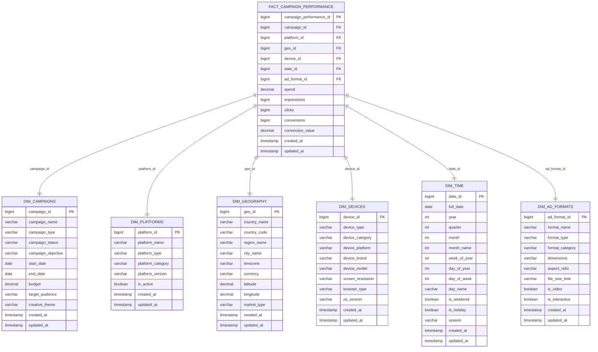
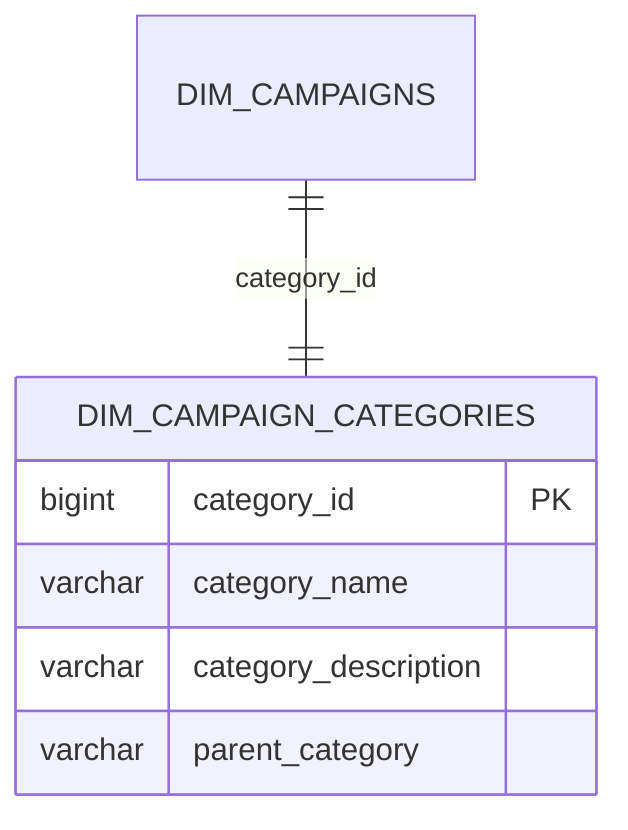
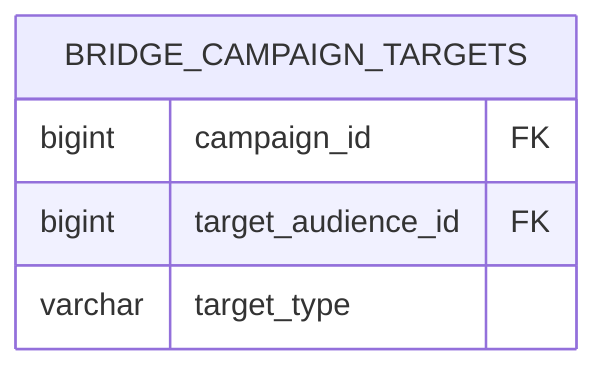

# 🌟 Ad Campaign Analytics Star Schema Diagram

## 📊 **Complete Data Model Visualization**



## 🔗 **Relationship Details**

### **Primary Keys (PK)**
- `campaign_performance_id` - Unique identifier for each performance record
- `campaign_id` - Campaign dimension identifier
- `platform_id` - Platform dimension identifier
- `geo_id` - Geography dimension identifier
- `device_id` - Device dimension identifier
- `date_id` - Time dimension identifier
- `ad_format_id` - Ad format dimension identifier

### **Foreign Keys (FK)**
- All dimension IDs in the fact table link to their respective dimension tables
- This creates the classic star schema pattern with the fact table at the center

### **Data Flow**
```
Raw Data → Staging → Dimensions → Fact Table → Analytics Mart
```

## 📈 **Star Schema Benefits**

### **1. Query Performance**
- **Fast Aggregations**: Pre-joined dimensions for quick calculations
- **Indexed Keys**: Optimized foreign key relationships
- **Denormalized Structure**: Reduces JOIN operations

### **2. Business Intelligence**
- **Intuitive Navigation**: Easy to understand business concepts
- **Flexible Analysis**: Multiple dimensional perspectives
- **Consistent Metrics**: Single source of truth for KPIs

### **3. Scalability**
- **Incremental Loading**: Add new data without full refresh
- **Partitioning**: Efficient data management by date
- **Compression**: Optimized storage for large datasets

## 🎯 **How to Generate This Diagram**

### **Method 1: Using dbt (Recommended)**

1. **Install dbt-docs**:
```bash
pip install dbt-docs
```

2. **Generate Documentation**:
```bash
cd dbt_project
dbt docs generate
dbt docs serve
```

3. **View in Browser**: Open `http://localhost:8080` to see your data model

### **Method 2: Using Mermaid Live Editor**

1. Go to [Mermaid Live Editor](https://mermaid.live/)
2. Copy the Mermaid code above
3. View the interactive diagram
4. Export as PNG, SVG, or PDF

### **Method 3: Using GitHub**

1. Create a `.md` file in your repository
2. Paste the Mermaid code
3. GitHub automatically renders the diagram
4. View in your repository

### **Method 4: Using Snowflake**

1. **Connect to Snowflake**:
```sql
-- View table relationships
SHOW TABLES IN ANALYTICS_MART;

-- View table structure
DESCRIBE TABLE FACT_CAMPAIGN_PERFORMANCE;
DESCRIBE TABLE DIM_CAMPAIGNS;
-- ... repeat for all tables
```

2. **Use Snowflake's Schema Browser**:
   - Navigate to your database
   - Use the visual schema browser
   - Export relationships

## 🔧 **Customizing the Diagram**

### **Add More Dimensions**


### **Add Bridge Tables**


## 📊 **Portfolio Integration**

### **Include in Your Portfolio**
1. **Technical Documentation**: Show data modeling skills
2. **Architecture Diagrams**: Demonstrate system design knowledge
3. **Business Understanding**: Show how data supports business needs
4. **Performance Optimization**: Highlight scalability considerations

### **Presentation Tips**
1. **Start with Business Context**: Why this schema design?
2. **Show Performance Benefits**: How it improves query speed
3. **Explain Design Decisions**: Why star vs. snowflake?
4. **Demonstrate Flexibility**: How easy to add new dimensions

---

## 🚀 **Next Steps**

1. **Generate the Diagram**: Use one of the methods above
2. **Customize**: Add your specific business requirements
3. **Document**: Explain design decisions and benefits
4. **Present**: Include in your portfolio showcase

**This star schema diagram will be a powerful addition to your portfolio, demonstrating advanced data modeling and architecture skills!** 🌟✨
